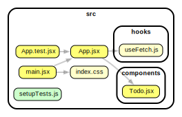

# Todo List

- [ ] Display a list of todos fetched from: `https://jsonplaceholder.typicode.com/todos`
- [ ] Conditionally render a checkbox next to each one indicating whether it's completed or not
- [ ] Allow a user to toggle the completion status of a todo by clicking on the checkbox. Of course, this should be reflected in the UI, but it will not be persistent.
- [ ] At the top, display the number of completed todos and the number of incomplete todos (e.g. "90 / 200 Completed")

## Suggested Approach

You may add additional components as you see fit. The above diagram is just a suggestion.
